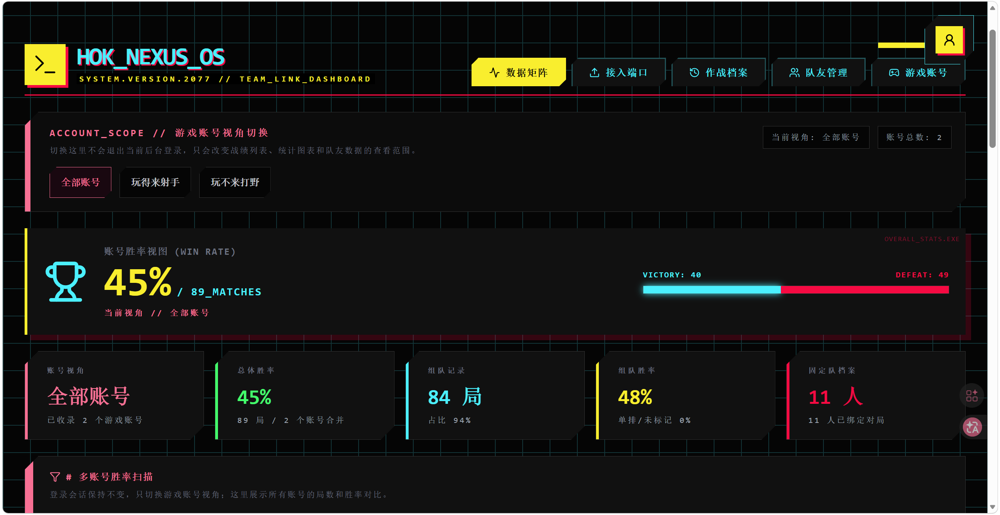
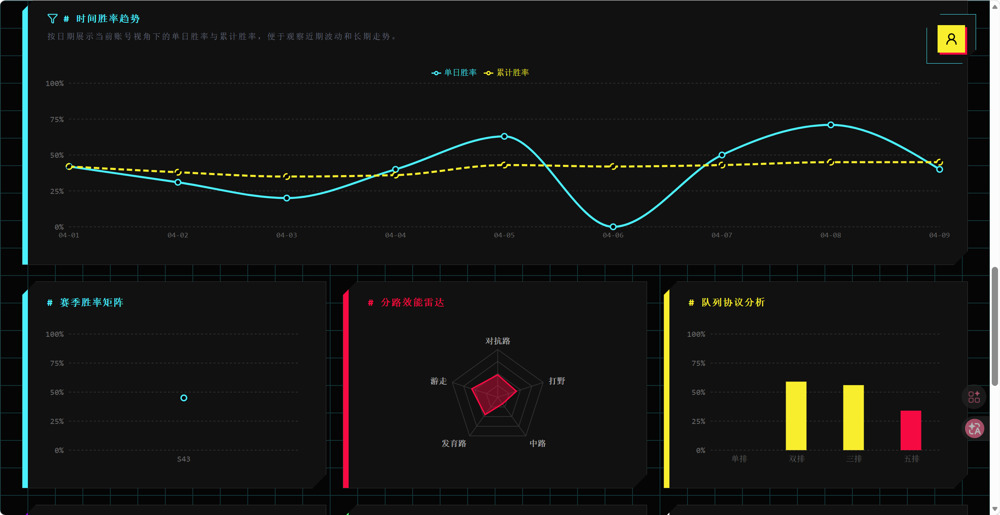
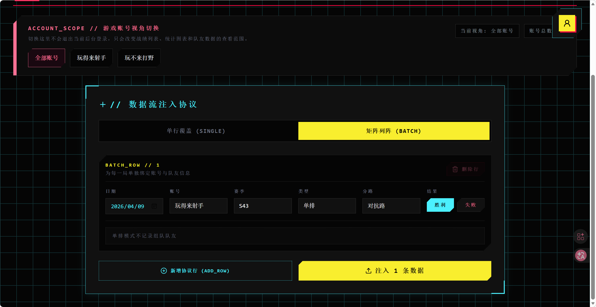

# HOK_NEXUS_OS

> 一个面向《王者荣耀》玩家的个人战绩档案系统。  
> 用来长期记录每一局对局结果，并从游戏账号、队友、时间、分路和组队关系等维度沉淀自己的数据视图。

`React` + `Vite` + `Spring Boot` + `MySQL`

HOK_NEXUS_OS 不是传统的“查一眼近期战绩”的页面，而是一套可以长期部署在自己服务器上的战绩管理后台。它支持网站登录、游戏账号视角切换、队友管理、战绩录入与编辑、多维图表统计，以及移动端访问，适合把《王者荣耀》的对局数据逐步积累成自己的可视化档案。

## 功能亮点

- 支持网站后台登录，密码使用 `BCrypt` 加密存储
- 支持多网站用户隔离，每个用户拥有独立的数据空间
- 支持多个游戏账号管理，并可切换账号视角查看战绩
- 支持单条录入和批量录入战绩
- 支持维护固定队友，并在双排、三排、五排战绩中绑定队友
- 支持战绩编辑、删除、按队友筛选日志
- 支持总体胜率、时间胜率趋势、赛季/分路/队列分析、队友组合统计
- 支持 1Panel 部署，适合长期自托管使用

## 项目截图

### 1. 数据矩阵总览



### 2. 时间胜率趋势与图表分析



### 3. 批量录入战绩



## 项目简介

这个网站用于记录《王者荣耀》的历史战绩，并从多个维度对对局进行统计分析，包括：

- 按游戏账号查看不同账号下的战绩情况
- 统计单个账号和全部账号合并后的总体胜率
- 管理经常一起开黑的队友信息
- 在双排、三排、五排战绩中绑定队友
- 按赛季、分路、队列类型、时间趋势分析胜率
- 查看固定队、队友组合、组队胜率等信息
- 在不退出后台登录的前提下切换游戏账号视角

它的定位不是游戏账号登录器，而是一个“个人战绩档案系统”。

## 核心功能

### 1. 网站登录与权限控制

- 首页默认是登录页
- 管理员账号由数据库直接维护，不开放注册功能
- 网站登录密码使用 `BCrypt` 加密存储
- 登录后使用 Session 维持会话
- 不同网站用户的数据完全隔离

### 2. 战绩录入

支持两种录入方式：

- 单条录入：适合手动补录单局战绩
- 批量录入：适合连续多局战绩快速录入

录入字段包括：

- 日期
- 游戏账号
- 赛季
- 队列类型（单排 / 双排 / 三排 / 五排）
- 分路
- 对局结果（胜利 / 失败）
- 队友信息

### 3. 战绩编辑与删除

- 已有战绩支持编辑
- 可修改日期、账号、赛季、队列、分路、结果、队友信息
- 支持删除错误战绩
- 日志页可按队友筛选记录

### 4. 游戏账号管理

- 支持维护多个常用游戏账号
- 可新增、编辑、删除游戏账号
- 可按账号切换统计视角
- 可展示全部账号合并后的总体胜率
- 第一个创建的账号会作为主账号参与默认录入逻辑

### 5. 队友管理

- 支持维护固定队友列表
- 可新增、删除常用队友
- 在录入战绩时直接从已维护的队友列表中选择
- 队列类型会限制可选队友人数：
  - 双排最多 1 名队友
  - 三排最多 2 名队友
  - 五排最多 4 名队友
  - 单排不记录队友

### 6. 图表统计分析

当前统计模块包含：

- 当前账号胜率总览
- 全部账号合并总体胜率
- 时间胜率趋势图
- 赛季胜率矩阵
- 分路胜率雷达图
- 队列协议分析
- 队友胜率排行
- 队友共战频次排行
- 队友组合排行
- 指定队友组合胜率统计
- 组队记录占比与组队胜率

### 7. 多账号与多用户隔离

系统区分两类“账号”：

- 网站登录账号：用于进入后台系统
- 游戏账号：用于归类具体战绩

这两类账号是不同概念。

例如：

- `app_users` 中的 `lyy`、`admin` 是网站用户
- `玩得来射手打`、`玩不来打野` 是游戏账号

并且每个网站用户拥有独立的数据空间：

- 自己的战绩
- 自己的队友列表
- 自己的游戏账号列表

互相之间不会共享。

## 技术架构

这是一个标准的前后端分离项目：

- 前端：`React + Vite`
- 后端：`Spring Boot + Spring Web + Spring Data JPA`
- 数据库：`MySQL`
- 图表：`Recharts`
- 图标：`lucide-react`
- 密码加密：`BCrypt`
- 部署方式：`1Panel + OpenResty + Java 运行环境 + MySQL`

## 项目结构

```text
wz_web/
├─ backend/                              # Spring Boot 后端
│  ├─ pom.xml
│  ├─ src/main/java/com/wzweb/backend/
│  │  ├─ account/                        # 游戏账号管理
│  │  ├─ auth/                           # 登录、会话、密码加密、管理员初始化
│  │  ├─ config/                         # Web 配置、CORS、拦截器
│  │  ├─ match/                          # 战绩实体、接口、服务
│  │  ├─ migration/                      # 历史数据迁移与数据归属修复
│  │  ├─ teammate/                       # 队友管理
│  │  └─ BackendApplication.java
│  └─ src/main/resources/
│     └─ application.properties
├─ frontend/                             # React 前端
│  ├─ package.json
│  ├─ vite.config.js
│  ├─ index.html
│  └─ src/
│     ├─ app/                            # 应用装配层
│     ├─ features/
│     │  ├─ auth/                        # 登录页、会话入口
│     │  └─ dashboard/                   # 数据矩阵、录入、日志、队友、账号等模块
│     └─ shared/
│        └─ api/                         # API 请求封装
├─ img/                                  # README 截图资源
├─ release/                              # 部署打包产物
├─ .gitignore
└─ README.md
```

## 数据库设计

当前主要表结构如下：

| 表名 | 作用 |
| --- | --- |
| `app_users` | 网站后台登录用户 |
| `game_accounts` | 游戏账号列表 |
| `teammates` | 队友列表 |
| `match_records` | 战绩主表 |
| `match_record_teammates` | 战绩与队友的多对多关联表 |

说明：

- `app_users` 保存后台登录信息
- 战绩、游戏账号、队友都按 `owner_user_id` 与网站用户绑定
- 密码只保存哈希，不保存明文
- 表结构由 JPA 自动维护，首次启动会自动建表

## 运行环境要求

### 前端

- Node.js 18+
- npm 9+

### 后端

- Java 17
- Maven Wrapper（项目内已提供）
- MySQL 8.x

## 本地开发

### 1. 创建数据库

先在本地 MySQL 中创建数据库：

```sql
CREATE DATABASE wz_web CHARACTER SET utf8mb4 COLLATE utf8mb4_general_ci;
```

### 2. 启动前端

```powershell
cd frontend
npm install
npm run dev
```

默认开发地址：

```text
http://localhost:5173
```

### 3. 启动后端

```powershell
cd backend
$env:WZ_DB_HOST='127.0.0.1'
$env:WZ_DB_PORT='3306'
$env:WZ_DB_NAME='wz_web'
$env:WZ_DB_USERNAME='root'
$env:WZ_DB_PASSWORD='你的数据库密码'
$env:SERVER_PORT='8080'
.\mvnw.cmd spring-boot:run
```

后端默认地址：

```text
http://localhost:8080
```

### 4. 首次创建管理员

如果你希望应用首次启动时自动生成后台登录管理员，可在启动前设置：

```powershell
$env:BOOTSTRAP_ADMIN_USERNAME='admin'
$env:BOOTSTRAP_ADMIN_PASSWORD='Admin123!'
$env:BOOTSTRAP_ADMIN_DISPLAY_NAME='系统管理员'
```

应用启动后，如果数据库里还没有这个用户名，就会自动创建一个管理员账号。

## 打包构建

### 打包前端

```powershell
cd frontend
npm run build
```

输出目录：

```text
frontend/dist/
```

### 打包后端

```powershell
cd backend
.\mvnw.cmd -DskipTests package
```

输出文件：

```text
backend/target/backend-0.0.1-SNAPSHOT.jar
```

## 后端环境变量

后端通过环境变量读取数据库和部署配置，常用项如下：

| 变量名 | 说明 |
| --- | --- |
| `WZ_DB_HOST` | MySQL 地址 |
| `WZ_DB_PORT` | MySQL 端口 |
| `WZ_DB_NAME` | 数据库名 |
| `WZ_DB_USERNAME` | 数据库用户名 |
| `WZ_DB_PASSWORD` | 数据库密码 |
| `SERVER_PORT` | Spring Boot 端口 |
| `CORS_ALLOWED_ORIGIN_PATTERNS` | 允许访问后端的前端来源 |
| `BOOTSTRAP_ADMIN_USERNAME` | 初始化管理员用户名 |
| `BOOTSTRAP_ADMIN_PASSWORD` | 初始化管理员密码 |
| `BOOTSTRAP_ADMIN_DISPLAY_NAME` | 初始化管理员显示名称 |

示例：

```env
WZ_DB_HOST=mysql
WZ_DB_PORT=3306
WZ_DB_NAME=wz_web
WZ_DB_USERNAME=wz_web_user
WZ_DB_PASSWORD=replace_with_your_password
SERVER_PORT=8080
CORS_ALLOWED_ORIGIN_PATTERNS=http://127.0.0.1:5173,http://localhost:5173,http://你的IP:8200,https://你的域名
BOOTSTRAP_ADMIN_USERNAME=admin
BOOTSTRAP_ADMIN_PASSWORD=Admin123!
BOOTSTRAP_ADMIN_DISPLAY_NAME=系统管理员
```

## 部署说明

项目已经提供适合 1Panel 使用的部署包，位于：

```text
release/wz_web_1panel_bundle_20260402.zip
```

部署包内包含：

- 前端静态资源
- 后端可执行 `jar`
- 环境变量模板
- Linux 启停脚本
- Nginx `/api` 反代示例
- 独立部署说明文档

详细部署说明可查看：

- [release/wz_web_1panel_bundle_20260402/README.md](release/wz_web_1panel_bundle_20260402/README.md)

### 1Panel 推荐部署拓扑

- `OpenResty`：托管前端静态网站
- `Java 运行环境`：运行 Spring Boot 后端
- `MySQL`：存储网站用户、游戏账号、队友、战绩数据
- `/api` 反向代理：网站域名下的接口请求转发到后端 `8080`

### 部署时的关键点

- 前端用户访问的是网站域名，不是 `8080`
- 后端 `8080` 只用于 API 服务
- MySQL 不建议开放公网
- 若使用 1Panel Java 容器，需要特别确认数据库连接地址和 CORS 来源配置
- 如果登录接口返回 `403`，优先检查 `CORS_ALLOWED_ORIGIN_PATTERNS`

## API 概览

前端主要调用以下接口：

- `/api/auth/login`：登录
- `/api/auth/me`：获取当前登录用户
- `/api/auth/logout`：退出登录
- `/api/matches`：战绩查询/新增
- `/api/matches/batch`：批量新增战绩
- `/api/matches/{id}`：编辑 / 删除单条战绩
- `/api/teammates`：队友管理
- `/api/game-accounts`：游戏账号管理
